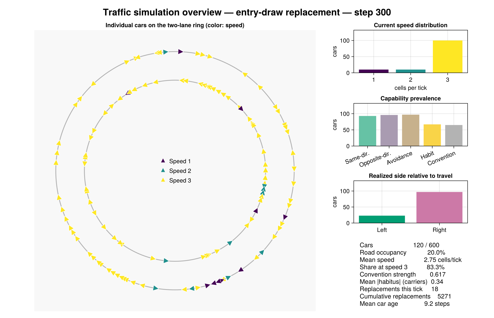
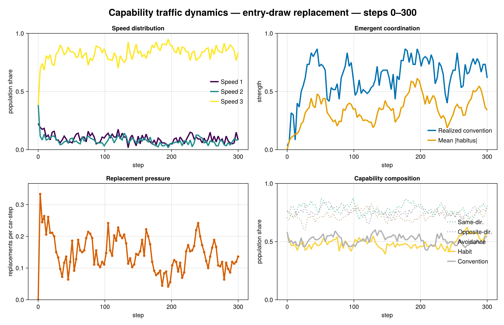
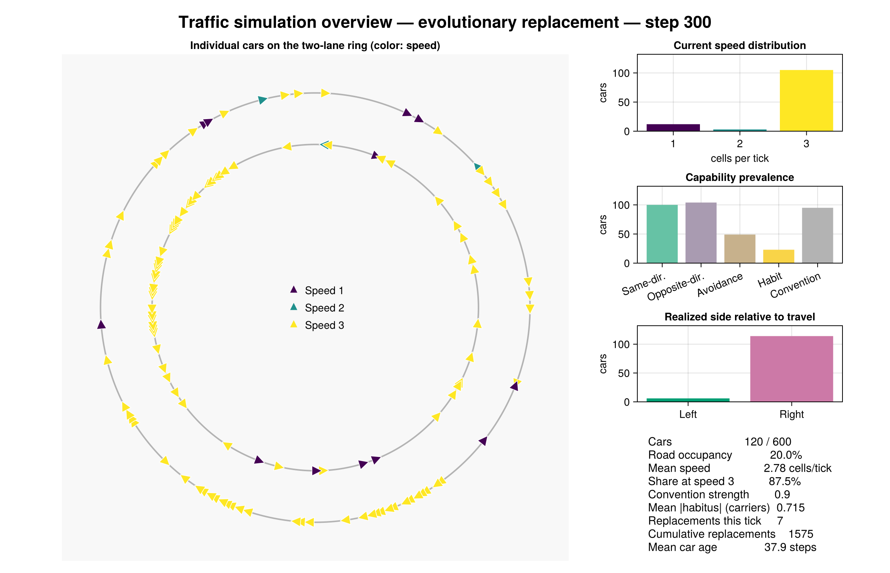
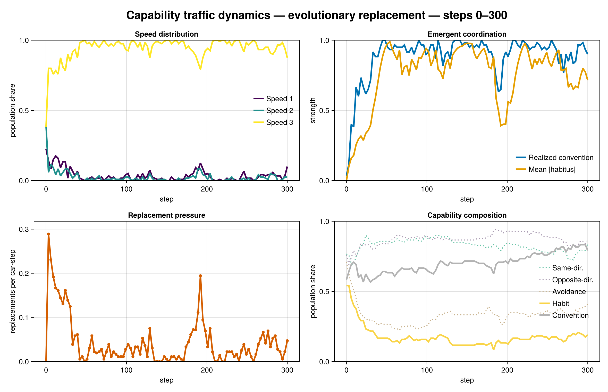

# Capability Traffic Model: Implementation and Initial Results

## Implemented model

The new `CapabilityModel` is a separate scientific treatment; the earlier forecast strategies remain available as legacy/oracle comparisons. Capability cars do not have a `DriverStrategy` and the capability world does not contain `PredictedOccupancy`.

Cars instead carry a universal physical and proposal core plus independently sampled optional components:

- `SameDirectionResponse`
- `OppositeDirectionResponse`
- `NearFieldAvoidance`
- `HabitFormation` with private `Habitus`
- `ConventionPerception` with private `PerceivedConvention`

The three traffic-response capabilities have independent 75% entry shares;
habit formation and convention perception have independent 50% shares. Thus
all five plotted mechanisms vary structurally across drivers. Speed adjustment
is universal because positive speed choice is part of the treatment's physical
action space, so it is not shown as a varying capability.

Every car has `Speed`, `SpeedAdjustment`, and a proposed three-micro-step `MovementPath`. The current speed is publicly observable, but capability bundles, sensitivities, acquired state, and current proposals remain private.

Each tick uses one committed snapshot. Cars observe local realized traffic, update their private convention estimate, compose lane evidence through the components they possess, and submit a lane proposal. They then search speeds from 3 down to 1 and select the first locally safe action, preferring the lane proposal at equal speed. Safety extrapolates other cars' currently observed lane and speed; it never reads their new proposal. All paths are resolved synchronously with intermediate-cell, destination, swap, and diagonal-crossing checks.

Collision replacements preserve direction, reset acquired state, draw an entry speed from 1–3, and redraw an independent capability bundle. This renews variation without artificially preserving the crashed driver's strategy.

The default torus is now 2 × 300 with 120 cars and a 60-cell observation horizon. Length, population, and horizon are all three times their earlier defaults, so road occupancy remains 20% while supporting speed-3 swept movement.

## Fixed scenario

The reproducible baseline visualization uses seed `20260730`, 120 cars, 300 ticks, default entry-draw replacement, the default capability shares, and speeds 1–3.

| Outcome | Initial | Tick 300 |
|---|---:|---:|
| Mean speed | 2.158 | 2.750 |
| Share at speed 3 | 0.383 | 0.833 |
| Convention strength | 0.033 | 0.617 |
| Replaced cars over run | — | 5,271 |

Convention strength is the absolute mean realized side, expressed relative to each driver's direction: zero denotes a balanced population and one denotes a uniform left/right convention.



The history view separates the mechanisms that the final torus cannot show: acceleration, convention and habit formation, replacement pressure, and selection over capability prevalence.



Animations:

- [Full capability composition](../plots/capability_speed_scenario.mp4)
- [No-habit/no-convention ablation](../plots/capability_speed_ablation.mp4)
- [Evolutionary replacement](../plots/capability_speed_evolutionary.mp4)

## Evolutionary replacement treatment

`EvolutionaryReplacement` selects a uniformly random survivor before creating
the tick's newborns. The newborn inherits the parent's optional capability
presence and quantitative traits. Each capability independently flips presence
with probability 0.02, while inherited sensitivities, disposition, learning
rate, and observation noise receive Gaussian mutations with standard deviation
0.05. Direction continues to replace the crashed direction, and acquired
habitus and perceived-convention state start from zero.

For the same seed and 300-tick horizon, the single evolutionary scenario gives:

| Outcome | Entry-draw replacement | Evolutionary replacement |
|---|---:|---:|
| Final mean speed | 2.750 | 2.775 |
| Final share at speed 3 | 0.833 | 0.875 |
| Final convention strength | 0.617 | 0.900 |
| Replaced cars | 5,271 | 1,575 |
| Same-direction capability | 0.775 | 0.833 |
| Opposite-direction capability | 0.800 | 0.867 |
| Avoidance capability | 0.808 | 0.408 |
| Habit capability | 0.558 | 0.192 |
| Convention-perception capability | 0.542 | 0.792 |





This one trajectory demonstrates that the mechanism creates actual population
evolution; it is not evidence that these particular shares or the lower
replacement count are general. Replicated mutation-rate and parent-selection
experiments are needed before interpreting the apparent rise of convention
perception or decline of habit and avoidance.

The follow-up [convention-free experiments](no_convention_results.md) remove
`ConventionPerception` as both an entry capability and a possible evolutionary
mutation. They compare habit against a no-habit control under both replacement
policies.

## Five-seed diagnostic

The following is a deterministic diagnostic over seeds `20260730:20260734`, not a statistical inference. Each run has 12,000 car-ticks. The ablation removes both `HabitFormation` and `ConventionPerception` while retaining physical traffic responses and speed adjustment.

| Mean outcome at/through tick 100 | Full composition | No habit or convention perception |
|---|---:|---:|
| Final mean speed | 2.722 | 2.688 |
| Final share at speed 3 | 0.830 | 0.802 |
| Replaced cars | 1,972.4 | 2,552.6 |
| Replacements, ticks 1–25 | 709.4 | 721.6 |
| Replacements, ticks 76–100 | 438.2 | 603.4 |
| Final convention strength | 0.630 | 0.460 |

The useful result is not perfect local avoidance: it does not occur. Cars cannot see contemporaneous proposals, so individually plausible actions can still collide. In the full treatment the replacement rate falls from 23.6% of car-ticks in the first quarter to 14.6% in the last quarter, while mean speed remains high. In the ablation the final-quarter rate is 20.1%. This is consistent with—though five runs cannot establish—the intended mechanism: observable speed introduces asymmetry and defensive adjustment, while acquired habit and locally perceived realized practice coordinate interactions that local path extrapolation cannot solve.

## Reproduction

Run:

```sh
julia --project=. -t auto notebooks/generate_capability_scenario.jl
```

The command regenerates the baseline and evolutionary PNG diagnostics plus the full-composition, ablation, and evolutionary MP4 animations, then prints the fixed-scenario measurements.
