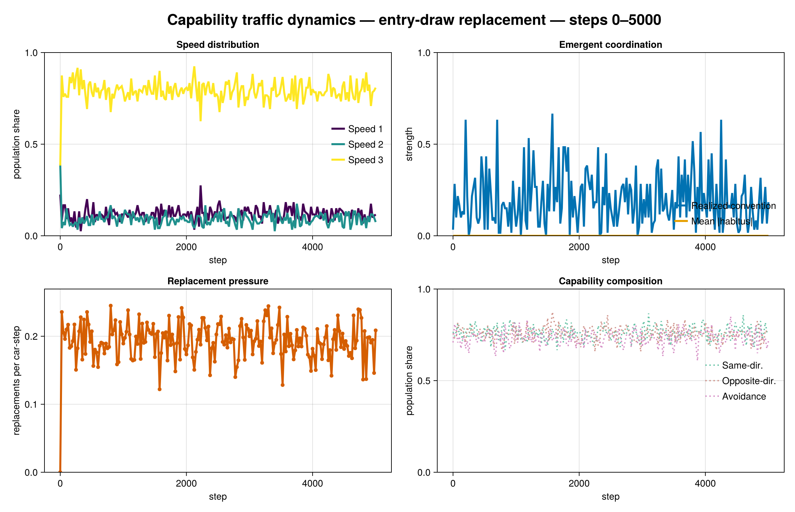

# Capability Traffic Model: Current Diagnostic

## Model boundary

`CapabilityModel` is the synchronous, multi-speed treatment. Cars share a
physical proposal core and may independently carry same-direction response,
opposite-direction response, near-field avoidance, Habit, Convention, and
SocialHabit. The three acquired capabilities have distinct information
sources but enter the same LR calculation additively:

- Habit reinforces the driver's own realized side with the age-dependent
  Hodgson–Knudsen update.
- Convention accumulates a history of locally observed sides chosen by other
  drivers.
- SocialHabit accumulates a history of observations of decaying spatial traces
  deposited by drivers whose paths succeeded.

All drivers choose a lane and a speed from 1–3 from one committed pre-decision
state. Collision replacements preserve direction and reset acquired state.
Static entry redraws capabilities from fixed probabilities; evolutionary
replacement inherits a surviving driver's capabilities with mutation.

The historical movement treatment searches speed before lane, so speed 3 is
selected whenever either lane has an exactly non-conflicting extrapolated
path. This is an explicit treatment assumption rather than a plotting error.
The replicated [speed-choice sensitivity experiment](speed_sensitivity_results.md)
shows that trying slower speeds on the LR-selected lane first is a Pareto
improvement, whereas adding a short clearance rule or imposing a speed-2 cap
does not improve both safety and completed progress.

## Updated 5,000-tick diagnostic

The diagnostic uses seed `20260730`, 120 cars on a 2 × 300 periodic road,
lookahead 20, and 5,000 ticks. The mixed treatment assigns independent 0.5
entry probabilities to Habit, Convention, and SocialHabit. Histories are
sampled every 25 ticks.

For the static-entry mixed trajectory, mean speed changes from 2.158 initially
to 2.625 at tick 5,000; 77.5% of cars choose speed 3 at the end. The final
realized convention is 0.333 and 77,375 replacements occur over the full run.
Final Habit, Convention, and SocialHabit carrier shares are 0.417, 0.483, and
0.508. This single path illustrates fluctuations; it is not the inferential
comparison.




The former tick-300 torus snapshots and torus animations were removed because
they predated the corrected capability semantics and obscured temporal
variation. The current plots expose speed distribution, realized convention,
acquired disposition, replacement pressure, and capability composition over
the complete horizon. Use the replicated
[social-habit experiment](social_habit_experiments.md) for treatment effects
and uncertainty.

## Reproduction

```sh
julia --project=. notebooks/generate_capability_scenario.jl
```

The command regenerates all three analytical history figures at 5,000 ticks.
