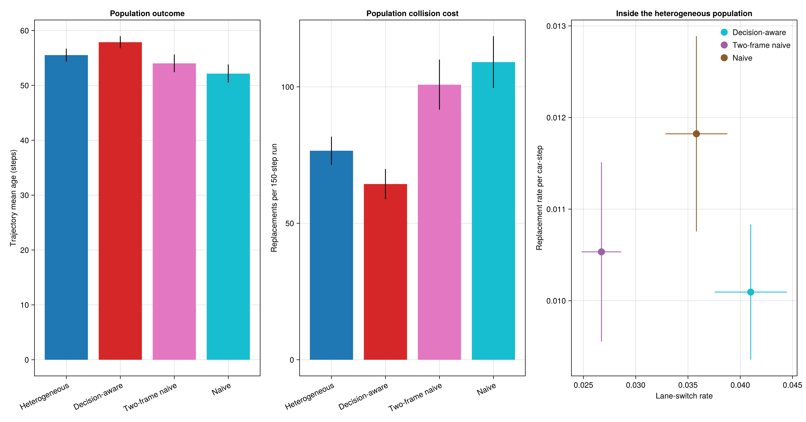
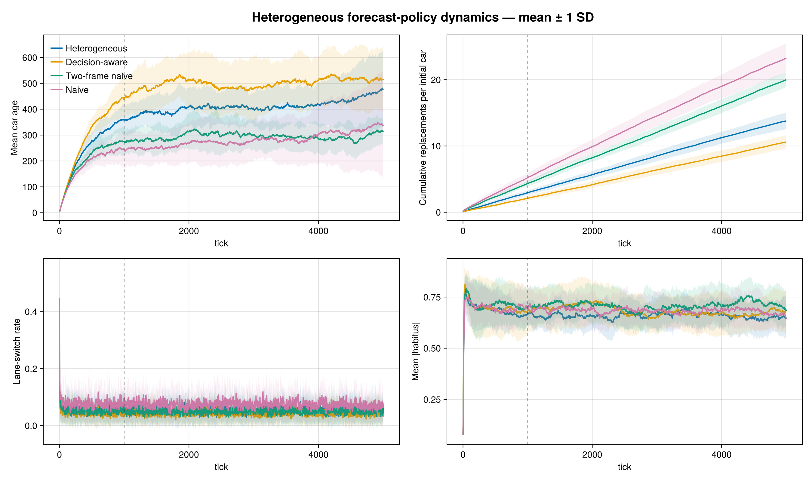

# Heterogeneous Forecast-Strategy Benchmark

This benchmark replaces an orphaned 150-tick artifact with a reproducible
5,000-tick study. Thirty paired seeds run with 48 cars on a 2 × 300 road,
lookahead 20, and a 1,000-tick burn-in. The heterogeneous population is 50%
Decision-aware, 25% Two-frame Naive, and 25% Naive; homogeneous versions are
the references. Replacement preserves the strategy mix.

| Scenario | Final age mean ± SD | Post-burn-in age mean ± SD | Replacement rate mean ± SD | Switch rate mean ± SD |
|---|---:|---:|---:|---:|
| Heterogeneous | 475.9 ± 150.7 | 410.7 ± 42.4 | 0.00271 ± 0.00030 | 0.0541 ± 0.0030 |
| Decision-aware | 516.4 ± 125.5 | 499.6 ± 62.7 | 0.00212 ± 0.00023 | 0.0432 ± 0.0029 |
| Two-frame Naive | 314.3 ± 50.2 | 293.9 ± 23.4 | 0.00391 ± 0.00025 | 0.0502 ± 0.0018 |
| Naive | 336.7 ± 208.6 | 281.5 ± 51.3 | 0.00451 ± 0.00055 | 0.0744 ± 0.0043 |

The mixture lies between its constituents rather than outperforming the
homogeneous Decision-aware policy. It substantially improves on Naive in
replacement and switching rates, but allowing weaker policies into the shared
forecast field carries a coordination cost.





Reproduce with:

```sh
julia --project=. -t auto notebooks/generate_heterogeneous_strategy.jl
```
