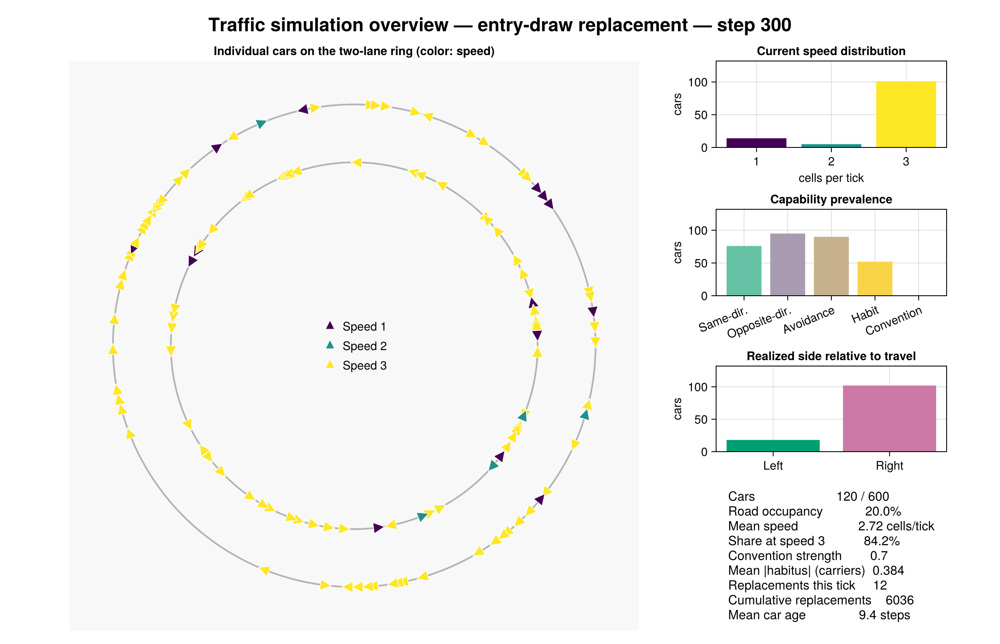
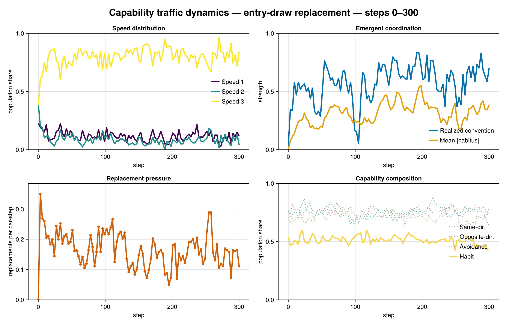
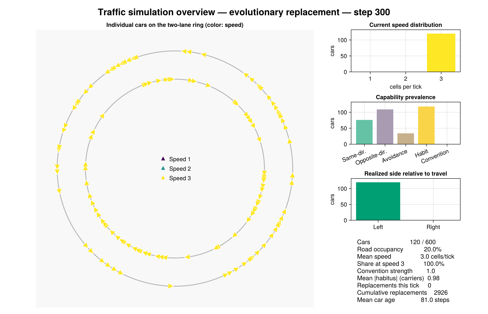
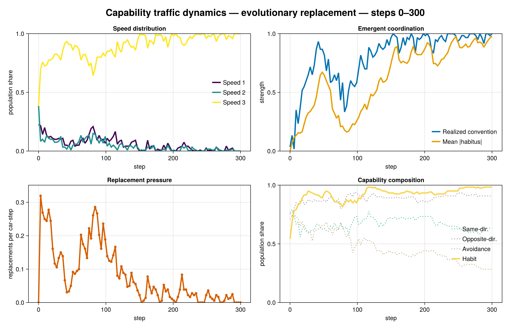

# Traffic Experiments Without Convention Perception

## Question and treatment boundary

These experiments test whether `ConventionPerception` crowds out
`HabitFormation`. Setting `convention_share = 0.0` removes the convention
perception component, its acquired belief state, and its lane-score tie-breaker.
Evolutionary mutation is also prohibited from reintroducing any capability whose
configured share is zero.

The model may still produce a realized left/right convention. That is an
outcome generated by traffic response, survival, and habit—not convention
information available to drivers. The reported “realized coordination” metric
is therefore retained as an outcome and must not be confused with the removed
capability.

## Design

The matched experiment uses seeds `20260730:20260734`, 120 cars, a 2 × 300
torus, speeds 1–3, and 300 ticks. It crosses:

1. habit entry share 0.5 versus a no-habit control;
2. independent entry-draw replacement versus evolutionary replacement.

All four treatments have convention perception fixed at zero. Evolution uses a
0.02 capability-presence mutation rate and 0.05 quantitative-trait mutation
scale. With habit disabled in the evolutionary control, mutation cannot restore
it.

## Five-seed results

| Mean outcome | Entry: habit | Entry: no habit | Evolution: habit | Evolution: no habit |
|---|---:|---:|---:|---:|
| Final mean speed | 2.735 | 2.752 | 2.967 | 2.893 |
| Final speed-3 share | 0.835 | 0.838 | 0.977 | 0.933 |
| Replaced cars | 6,414.0 | 7,266.4 | 3,141.6 | 3,350.6 |
| Replacement rate per car-tick | 0.178 | 0.202 | 0.087 | 0.093 |
| Early replacement rate, ticks 1–75 | 0.179 | 0.217 | 0.173 | 0.171 |
| Late replacement rate, ticks 226–300 | 0.188 | 0.194 | 0.040 | 0.051 |
| Final realized coordination | 0.517 | 0.670 | 0.957 | 0.870 |
| Mean absolute habitus among carriers | 0.296 | — | 0.853 | — |
| Final habit capability share | 0.502 | 0.000 | 0.718 | 0.000 |
| Final convention-perception share | 0.000 | 0.000 | 0.000 | 0.000 |

Under entry redraw, habit reduces cumulative replacements by 11.7%, although it
slightly lowers final speed and its late-run advantage is modest. Its population
share stays close to 0.5 because every replacement is independently redrawn
from that entry distribution.

Under evolutionary replacement, habit raises final speed, reduces cumulative
replacements by 6.2%, and reduces late-run replacement pressure by 22.5%. Its
population share rises to 0.718. In the matched five-seed evolutionary treatment
where convention perception is available, the final mean habit share is 0.487.
The comparison therefore supports the crowd-out observation: removing
convention perception reveals positive selection for habit that is hidden when
both mechanisms coexist.

The no-habit entry control has greater final realized coordination than the
habit treatment despite more replacements. This is a useful warning that a
single final convention-strength statistic is not a sufficient safety or
welfare measure.

## Visualizations

### Entry-draw replacement





[Convention-free entry animation](../plots/no_convention_entry.mp4)

### Evolutionary replacement





[Convention-free evolutionary animation](../plots/no_convention_evolutionary.mp4)

## Reproduction

```sh
julia --project=. -t auto notebooks/generate_no_convention_experiments.jl
```

The script runs all four matched treatments and regenerates the two habit-enabled
scenario dashboards, history plots, and animations.
