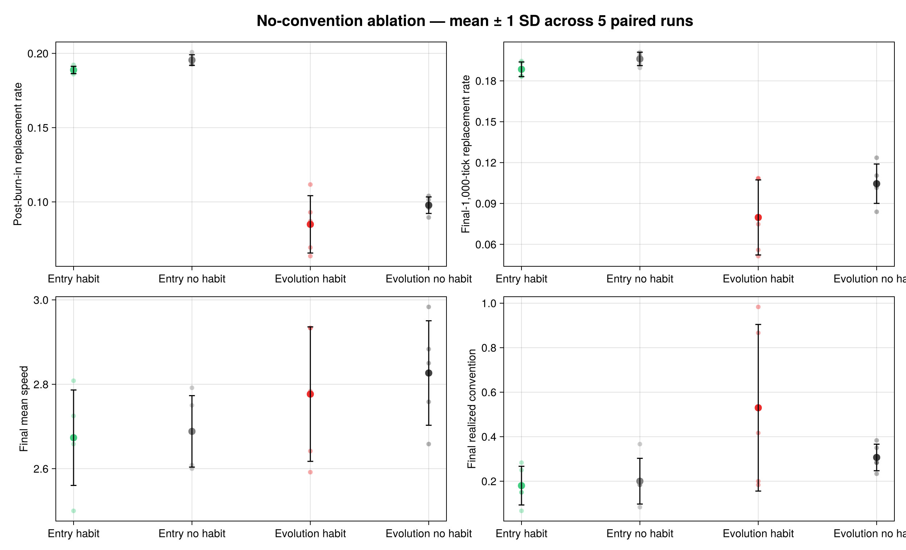

# Traffic Experiments Without Convention Perception

## Treatment boundary

This ablation fixes `convention_share = 0.0`, removing both the component and
its LR contribution. Evolutionary mutation cannot restore a capability whose
configured share is zero. A realized lane convention can still emerge as an
outcome of traffic response, survival, and Habit; it is not information made
available through Convention.

## Updated design

Five paired seeds (`20260730:20260734`) run for 5,000 ticks, with a 1,000-tick
burn-in, 120 cars, a 2 × 300 road, and lookahead 20. The experiment crosses a
0.5 Habit entry share versus no Habit with static-entry versus evolutionary
replacement. The small ensemble is a diagnostic, not a formal inference.

| Mean outcome | Entry: Habit | Entry: no Habit | Evolution: Habit | Evolution: no Habit |
|---|---:|---:|---:|---:|
| Final mean speed | 2.673 | 2.688 | 2.777 | 2.827 |
| Post-burn-in replacement rate | 0.1888 | 0.1955 | 0.0849 | 0.0978 |
| Final-1,000-tick replacement rate | 0.1885 | 0.1961 | 0.0797 | 0.1045 |
| Final realized convention | 0.180 | 0.200 | 0.530 | 0.307 |
| Final Habit share | 0.520 | 0 | 0.437 | 0 |
| Mean absolute habit among carriers | 0.198 | 0 | 0.509 | 0 |

Habit lowers replacement pressure under both policies. Under evolutionary
replacement its final-window reduction is larger (0.0797 versus 0.1045), and
the Habit treatment has stronger realized coordination. Under fixed entry,
the final convention difference is small and reversed. This reinforces why a
single final convention value is not a sufficient safety measure.




The former torus snapshots and animations were removed as short-horizon relics.
The replacement figures show replicate dispersion and the 5,000-tick histories
of the two Habit-enabled treatments.

## Reproduction

```sh
julia --project=. -t auto notebooks/generate_no_convention_experiments.jl
```
