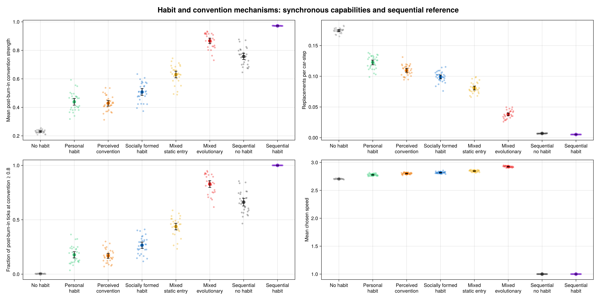
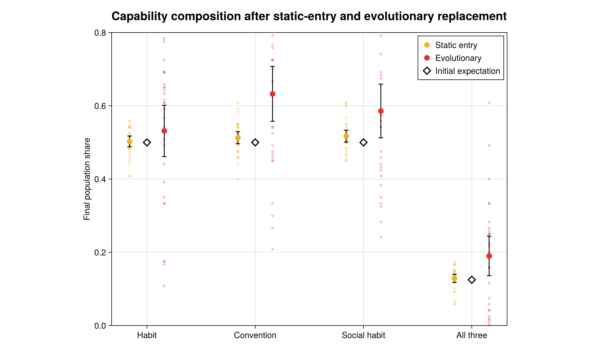
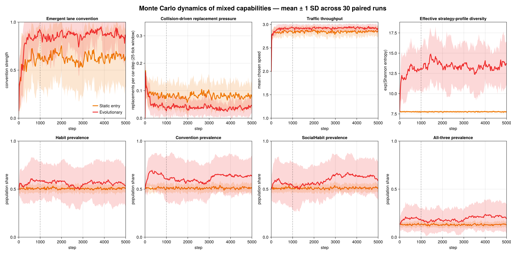

# Socially Formed Habit Experiment

## Capabilities compared

The synchronous capability model holds bounded traffic response, parameters,
initial positions, directions, and paired seeds fixed while varying the source
of disposition entering LR:

| Scenario | Information accumulated | LR contribution |
|---|---|---|
| No habit | None | None |
| Habit | Time on the driver's own realized side | Weighted personal Habit |
| Convention | History of locally observed sides chosen by others | Weighted Convention |
| SocialHabit | History of local samples from vanishing successful-driver traces | Weighted SocialHabit |
| Mixed, static entry | Independent 0.5 chance of all three capabilities | Sum of capabilities carried; fixed entry draws |
| Mixed, evolutionary | Same initial mixture | Sum carried; survivor inheritance and mutation |

Habit uses the original age-dependent Hodgson–Knudsen reinforcement. Convention
updates a private history from other drivers' realized local choices.
Successful drivers deposit signed side-choice information along completed
paths; this spatial trace decays geometrically, and SocialHabit builds a
private history from local trace observations. All three dispositions are
additive inputs to `LaneScore`/LR, not tie-breakers.

The sequential reference uses the original unit-speed agent model with and
without Habit. It is a contrast in activation semantics, not another member of
the synchronous capability factorial: later sequential drivers observe moves
committed earlier in the same tick.

## Updated 5,000-tick design

Thirty paired seeds (`20260901:20260930`) run for 5,000 ticks with a 1,000-tick
burn-in, 120 cars, a 2 × 300 road, and lookahead 20. Intervals are 95% normal
intervals for replicate means. `Coordinated time` is the fraction of 4,000
post-burn-in ticks with realized convention strength at least 0.8.

| Scenario | Mean convention | Coordinated time | Replacements/car-step | Mean speed |
|---|---:|---:|---:|---:|
| No habit | 0.230 [0.226, 0.235] | 0.004 [0.003, 0.004] | 0.1743 [0.1730, 0.1757] | 2.704 [2.702, 2.706] |
| Habit | 0.439 [0.415, 0.462] | 0.178 [0.149, 0.206] | 0.1226 [0.1187, 0.1264] | 2.778 [2.771, 2.784] |
| Convention | 0.429 [0.409, 0.448] | 0.168 [0.146, 0.190] | 0.1097 [0.1065, 0.1129] | 2.801 [2.796, 2.806] |
| SocialHabit | 0.508 [0.484, 0.532] | 0.266 [0.237, 0.295] | 0.0990 [0.0960, 0.1021] | 2.818 [2.813, 2.823] |
| Mixed, static entry | 0.630 [0.607, 0.654] | 0.438 [0.408, 0.468] | 0.0809 [0.0778, 0.0840] | 2.846 [2.841, 2.851] |
| Mixed, evolutionary | **0.867 [0.848, 0.885]** | **0.828 [0.797, 0.859]** | **0.0380 [0.0357, 0.0403]** | **2.923 [2.919, 2.928]** |

All three pure capabilities improve all four long-run outcomes relative to no
habit. Paired changes are:

| Capability minus no habit | Convention | Coordinated time | Replacement rate | Speed |
|---|---:|---:|---:|---:|
| Habit | +0.208 [0.185, 0.232] | +0.174 [0.146, 0.203] | −0.0518 [−0.0554, −0.0482] | +0.073 [0.067, 0.079] |
| Convention | +0.198 [0.178, 0.218] | +0.165 [0.143, 0.187] | −0.0646 [−0.0682, −0.0611] | +0.097 [0.091, 0.102] |
| SocialHabit | +0.277 [0.254, 0.301] | +0.263 [0.234, 0.291] | −0.0753 [−0.0785, −0.0721] | +0.113 [0.108, 0.118] |

Habit and Convention have similar mean convention strength, but Convention
produces lower replacement pressure and higher speed. SocialHabit is the
strongest pure treatment on every reported outcome. Its trace filters for
successful movement and persists spatial information beyond a direct local
encounter, while remaining a privately accumulated history rather than a
population-level oracle.

## Does the mixture perform better?

Yes. Static entry improves on pure SocialHabit by +0.123 [0.096, 0.150] in
convention, +0.172 [0.138, 0.205] in coordinated time, −0.0182 [−0.0218,
−0.0146] in replacement rate, and +0.028 [0.022, 0.034] in speed.

Evolution adds a further +0.236 [0.208, 0.265] convention, +0.390 [0.349,
0.432] coordinated time, −0.0428 [−0.0465, −0.0392] replacement rate,
and +0.0776 [0.0713, 0.0839] speed relative to static entry. The evolutionary
mixture also has much longer coordinated episodes: its mean run-level episode
length is 38.2 ticks and its mean longest episode is 361.7 ticks, versus 13.8
and 168.1 under static entry.

Final capability shares remain dispersed under evolution:

| Treatment | Habit mean ± SD | Convention mean ± SD | SocialHabit mean ± SD | All three mean ± SD |
|---|---:|---:|---:|---:|
| Static entry | 0.503 ± 0.041 | 0.513 ± 0.046 | 0.517 ± 0.045 | 0.129 ± 0.031 |
| Evolutionary | 0.531 ± 0.196 | 0.633 ± 0.209 | 0.586 ± 0.205 | 0.190 ± 0.151 |

Thus evolution improves traffic-level coordination without converging to a
single capability profile. At tick 5,000 the effective number of profiles is
7.75 ± 0.12 under static entry and 13.62 ± 2.69 under evolution.







The ensemble figure samples every 25 ticks; solid lines are means and ribbons
are ±1 SD. A dashed line marks the 1,000-tick burn-in. From ticks 1,000–2,000
to ticks 4,000–5,000, static-entry mean convention changes from 0.649 to 0.639
and replacement pressure from 0.0779 to 0.0801. Evolution changes from 0.847 to
0.866 and from 0.0409 to 0.0376. The broad regime averages are therefore
substantially more stable than they were at 1,000 ticks, even though individual
25-tick windows still fluctuate.

The torus-free analytical animation uses seed `20260901` and 201 frames across
the complete 5,000-tick horizon:

[Open the mixture analysis animation](../plots/social_habit_mixture_comparison.mp4)

## Sequential contrast

The sequential no-Habit reference has mean convention 0.757 [0.736, 0.779],
coordinated time 0.661 [0.627, 0.696], and replacement rate 0.00690. With
original Habit these become 0.972 [0.971, 0.972], 1.000, and 0.00518. The
sequential model's lower replacement pressure is not a like-for-like
capability advantage: it has within-tick ordering information and mandatory
unit speed rather than synchronous speed choice from 1–3.

## Reproduction

```sh
julia --project=. -t auto notebooks/run_social_habit_experiment.jl
julia --project=. -t auto notebooks/run_mixture_ensemble_dynamics.jl
julia --project=. notebooks/animate_social_habit_mixture.jl
```

The run-level CSV also contains first threshold crossing, coordinated episode
counts and lengths, acquired-state strength, and final capability shares.
