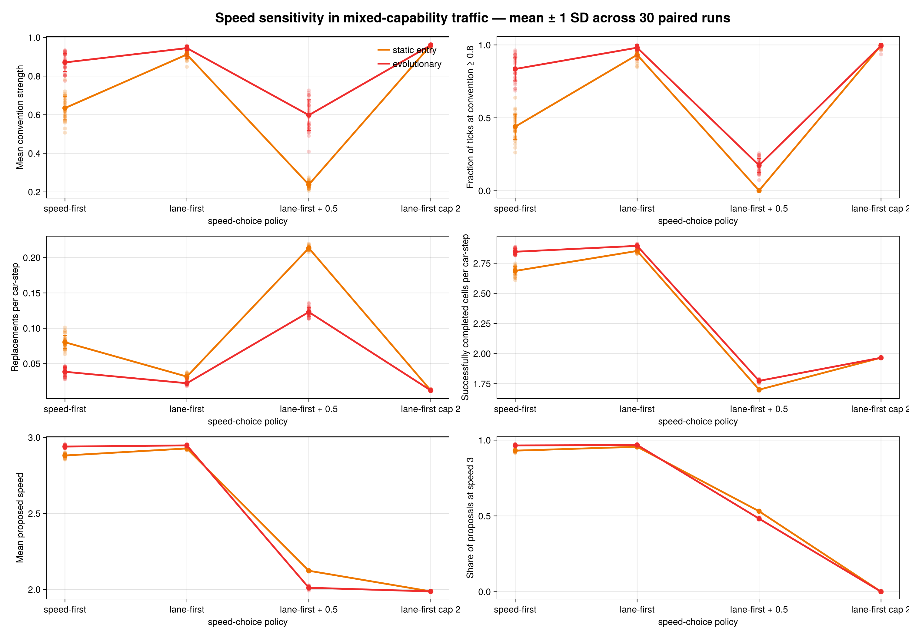

# Speed-choice sensitivity experiment

## Finding

Speed 3 dominates because the original capability movement rule searches
actions lexicographically: it tries speed 3 before speeds 2 and 1, regards an
action as safe unless its extrapolated path intersects another current-motion
path exactly, and only then uses lane preference to break an equal-speed tie.
At 20% occupancy this makes the maximum speed locally admissible most of the
time. The observed concentration at speed 3 is therefore a consequence of the
choice rule, not a logging error.

Making speed respond to a short local clearance does reduce the share of
speed-3 proposals, but it does not improve this synchronous model. Because
drivers only observe current motion, they cannot anticipate one another's
simultaneous braking and lane proposals. The added rule produces heterogeneous,
mutually inconsistent speed changes and sharply increases conflicts.

Changing the priority of the existing action search is effective. A
**lane-first** driver tries slower safe speeds on its disposed lane before
abandoning that lane. This preserves the LR decision and improves convention,
coordination, replacement pressure, and successfully completed progress under
both replacement regimes. It does not make the speed distribution more varied;
indeed, safer coordination makes speed 3 slightly more common.

## Design

The experiment uses 30 paired seeds, 5,000 ticks per run, a 1,000-tick burn-in,
lookahead 20, 120 cars, and a 2 × 300 periodic road. Every car has the three
traffic-response capabilities and independently carries Habit, Convention, and
SocialHabit with probability 0.5. The same four speed policies are compared
under static-entry and evolutionary replacement:

1. `speed-first`: historical fastest-safe action search;
2. `lane-first`: preserve the disposed lane before preserving speed;
3. `lane-first + 0.5`: lane-first plus speed-dependent clearance;
4. `lane-first cap 2`: lane-first with maximum speed 2.

`Successfully completed cells per car-step` counts the proposed distance of
cars that survive conflict resolution, divided by the initial population. It
therefore measures useful movement rather than proposed speed alone.



## Ensemble results

Values are means across 30 paired runs; parentheses give one standard
deviation. `Speed 3` is the share of submitted speed-3 proposals.

### Static-entry replacement

| Policy | Convention | Coordinated ticks | Replacements | Completed cells | Proposed speed | Speed 3 |
|---|---:|---:|---:|---:|---:|---:|
| speed-first | 0.6343 (0.0614) | 0.4395 (0.0862) | 0.0802 (0.0092) | 2.6867 (0.0340) | 2.8810 (0.0117) | 0.9308 (0.0068) |
| lane-first | 0.9117 (0.0196) | 0.9322 (0.0334) | 0.0316 (0.0028) | 2.8525 (0.0118) | 2.9273 (0.0054) | 0.9563 (0.0032) |
| lane-first + 0.5 | 0.2378 (0.0167) | 0.0011 (0.0010) | 0.2135 (0.0026) | 1.7003 (0.0052) | 2.1229 (0.0028) | 0.5309 (0.0013) |
| lane-first cap 2 | 0.9599 (0.0045) | 0.9965 (0.0080) | 0.0121 (0.0006) | 1.9655 (0.0016) | 1.9870 (0.0006) | 0.0000 (0.0000) |

### Evolutionary replacement

| Policy | Convention | Coordinated ticks | Replacements | Completed cells | Proposed speed | Speed 3 |
|---|---:|---:|---:|---:|---:|---:|
| speed-first | 0.8707 (0.0474) | 0.8350 (0.0821) | 0.0385 (0.0061) | 2.8457 (0.0237) | 2.9397 (0.0089) | 0.9650 (0.0052) |
| lane-first | 0.9449 (0.0128) | 0.9811 (0.0217) | 0.0222 (0.0023) | 2.8946 (0.0100) | 2.9475 (0.0046) | 0.9684 (0.0027) |
| lane-first + 0.5 | 0.5977 (0.0790) | 0.1741 (0.0471) | 0.1230 (0.0059) | 1.7737 (0.0083) | 2.0111 (0.0078) | 0.4819 (0.0035) |
| lane-first cap 2 | 0.9601 (0.0076) | 0.9947 (0.0137) | 0.0120 (0.0007) | 1.9655 (0.0020) | 1.9869 (0.0007) | 0.0000 (0.0000) |

The paired lane-first effect is unambiguously favorable. Relative to
speed-first, it raises completed progress by 0.166 cells per car-step under
static entry (95% paired interval 0.154–0.178) and by 0.049 under evolution
(0.040–0.058), while reducing replacements by 0.0486 and 0.0162 respectively.

The cap-2 policy instead exchanges throughput for safety. Relative to the
baseline it loses 0.721 completed cells per car-step under static entry and
0.880 under evolution, although replacement rates fall substantially. It is
preferable only if a replacement is valued at more than about 10.6 completed
cells under static entry or 33.3 under evolution. The clearance policy is
strictly worse on all reported performance outcomes.

## Implementation and reproduction

`CapabilityModel` now exposes two optional controls while retaining the
historical defaults:

```julia
Traffic.CapabilityModel(
    prefer_lane_over_speed = true,
    speed_clearance = 0.0,
)
```

The experiment is reproducible with:

```sh
julia --project=. -t auto notebooks/run_speed_sensitivity_experiment.jl
```

Run-level observations are in `plots/speed_sensitivity_runs.csv`. The default
remains speed-first so that the existing 5,000-tick capability comparisons
retain a common, explicitly identified movement treatment. The ensemble
evidence supports using lane-first in a subsequent revised-model experiment.
