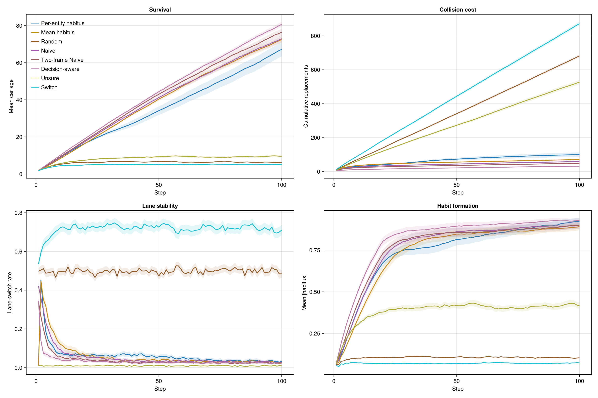
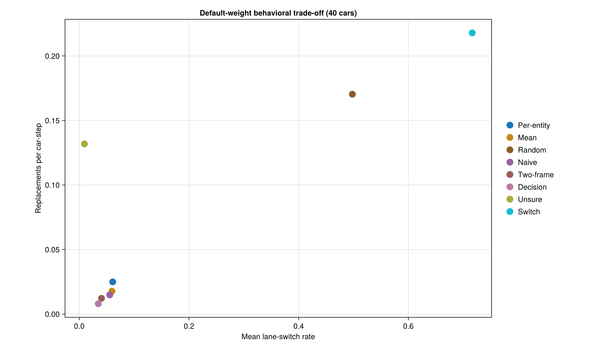
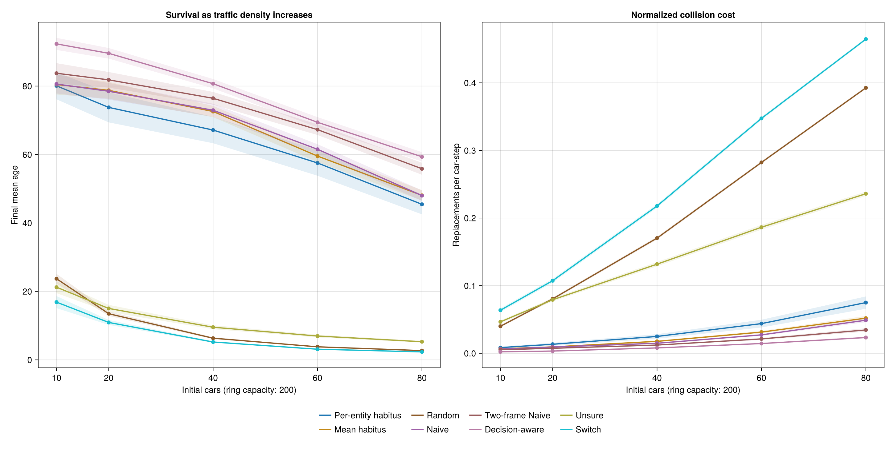
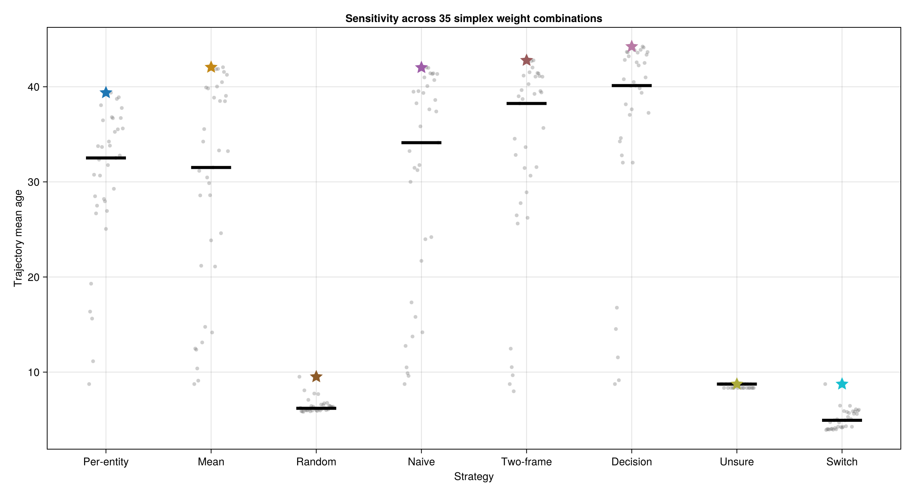

# Traffic Strategy Analysis

## Executive finding

**Decision-aware is the strongest of the eight tested occupancy strategies, while Two-frame Naive is a simpler improvement that uses only current-time driver information.** At the default 40-car setting, Two-frame Naive raises trajectory mean age from Naive's `39.86` to `41.61` and reduces mean replacements from `59.33` to `48.80`. Its paired gains are `+1.75` trajectory-age steps (95% CI `0.89–2.62`) and `−10.53` replacements (CI `−15.10–−5.96`). Decision-aware remains best overall at `43.46` trajectory age and `31.88` replacements.

Predicted occupancy enters each car's lane decision and thereby changes the state being predicted. These strategies are therefore coupled **forecast-and-control policies**, not passive forecasting models.

## Experiment design

The evaluation uses 100 paired replicates, 100 steps, and master seed 42. Every strategy receives the same replicate seeds at each density: 10, 20, 40, 60, and 80 cars on a 200-cell ring. Baseline runs use `(wₛ,wₒ,wₐ,wₕ) = (0.5,0.5,0.5,0.0)`. Figure bands are 95% Monte Carlo confidence intervals.

Decision-aware's defaults—five iterations and damping `0.5`—were selected separately using 50 paired training replicates from seed 20260724. In that small grid, the selected setting achieved trajectory age `43.38` and `30.58` replacements, versus `39.38` and `63.34` for Naive. The master-seed results below are held out from that choice.

“Replacements” counts removed and respawned cars, not collision events. Mean age measures survival/turnover, while lane-switch rates exclude newborn cars that have not moved.

## Baseline comparison

| Strategy | Final age | Trajectory age | Replacements | Replacements/car-step | Switch rate | Final mean \|habitus\| |
|---|---:|---:|---:|---:|---:|---:|
| Decision-aware | 80.69 | 43.46 | 31.88 | 0.0080 | 0.035 | 0.927 |
| Two-frame Naive | 76.43 | 41.61 | 48.80 | 0.0122 | 0.041 | 0.898 |
| Naive | 72.93 | 39.86 | 59.33 | 0.0148 | 0.056 | 0.898 |
| Mean habitus | 72.56 | 39.22 | 70.74 | 0.0177 | 0.060 | 0.892 |
| Per-entity habitus | 67.14 | 34.75 | 99.77 | 0.0249 | 0.061 | 0.921 |
| Unsure | 9.53 | 8.33 | 527.31 | 0.1318 | 0.009 | 0.417 |
| Random | 6.32 | 6.15 | 681.44 | 0.1704 | 0.498 | 0.104 |
| Switch | 5.21 | 4.90 | 871.53 | 0.2179 | 0.716 | 0.073 |



Naive and Mean remain statistically similar in survival: the paired Naive-minus-Mean final-age difference is `+0.37` (CI `−1.94–2.68`). Naive nevertheless averages `11.41` fewer replacements (CI `5.27–17.55`). Naive also clearly improves on Per-entity habitus: `+5.79` final age (CI `1.70–9.88`) and `−40.44` replacements (CI `−54.07–−26.82`).

## Why advancing the timeframe helps

Naive evaluates next-step occupancy from the car's current location. Two-frame Naive also advances that car one movement step and recomputes the same score from the anticipated location. It changes lane only when the current- and advanced-frame scores agree; disagreement preserves the current lane. It observes only current positions and directions plus the driver's own traits—no other driver's hidden state or future action.

Blindly replacing the current frame with the advanced frame performs worse because it overreacts to a single extrapolation. Requiring agreement instead acts as a temporal consistency check. At 40 cars it cuts the switch rate from `5.56%` to `4.06%`; at 80 cars it saves `115.16` replacements per run (CI `85.28–145.04`). The gain is significant from 20 cars upward, while the 10-car interval narrowly includes zero because interactions are sparse.

## Why Decision-aware improves further

Decision-aware closes the full feedback loop. It starts from current lanes, rebuilds probabilistic next-step occupancy, evaluates the existing lane-decision score for every car, and performs five damped best-response updates. The final probabilities also include the model's `ϵ` lane-choice error. Damping limits oscillation when two cars' best responses depend on each other. The result anticipates coordinated lane changes while retaining Naive's stable initialization. Relative to Naive, it adds `+3.60` trajectory-age steps (CI `2.69–4.52`) and avoids `27.45` replacements (CI `22.70–32.21`).

The remaining strategies explain what the fixed point avoids:

- **Mean habitus** converges toward Naive as population habit strength grows, but is uncertain during the early transient.
- **Per-entity habitus** forecasts historical lane preference, which can lag current position and induced choice.
- **Unsure** erases left/right occupancy contrast; low switching here reflects failed coordination, not safety.
- **Random** continually disrupts prediction and habit formation.
- **Switch** forecasts the opposite lane and creates destabilizing feedback.



## Density robustness



Decision-aware leads at all five densities. From 10 to 80 cars, its final age declines from `92.32` to `59.34`; Two-frame Naive declines from `83.74` to `55.84`, and Naive from `80.59` to `47.99`. At 80 cars, their replacement rates are respectively `0.0233`, `0.0345`, and `0.0489` per car-step. Advancing the timeframe therefore preserves a substantial advantage as interaction density grows, although full decision-aware iteration remains stronger.

The policy does not remove the capacity effect: survival still falls and first replacements occur almost immediately at high density. It does, however, make the degradation markedly slower.

## Weight sensitivity

The weight experiment evaluates 35 normalized simplex combinations at increments of 0.25, with 50 paired replicates per combination. It is separate from the unnormalized default baseline.



Decision-aware has both the highest median trajectory age (`40.12`) and highest coarse-grid maximum (`44.23`), obtained at `(wₛ,wₒ,wₐ,wₕ) = (0.5,0.25,0,0.25)`. Two-frame Naive's median and maximum are `38.24` and `42.78`, versus Naive's `34.12` and `42.02`. This indicates that the two-frame gain is not confined to the default weights, even though Decision-aware remains stronger.

The best points differ across the stronger methods, so the coarse grid does not support a universal weight prescription. Two-frame Naive peaks at `(0.25,0.75,0,0)`, emphasizing directional lane composition without near-field avoidance or habit persistence. Random, Unsure, and Switch peak when behavioral forecast weights are largely disabled, confirming that their occupancy signals are harmful. A finer, separately held-out optimization is needed before claiming globally optimal weights.

## Interpretation limits

The model maintains constant population by immediately respawning removed cars, uses synchronous unit-speed movement, and has only two lanes with periodic boundaries. Mean age and replacement rate are useful internal stability measures, not real-world throughput or crash-risk estimates. The first-step shock also reflects random initial positions without warm-up. Future work should add forecast calibration, collision-event counts, throughput, longer horizons, asynchronous decisions, and out-of-sample road geometries.

The complete aggregate tables and 4,000 replicate-level observations are in `plots/strategy_analysis/`. Recreate the analysis with:

```bash
julia -t auto --project=. notebooks/strategy_analysis.jl
```
